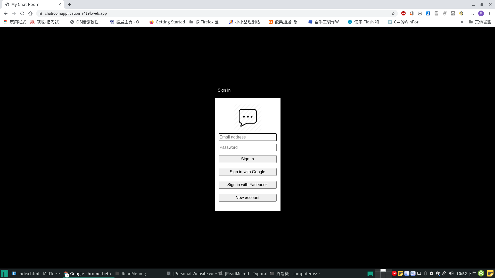
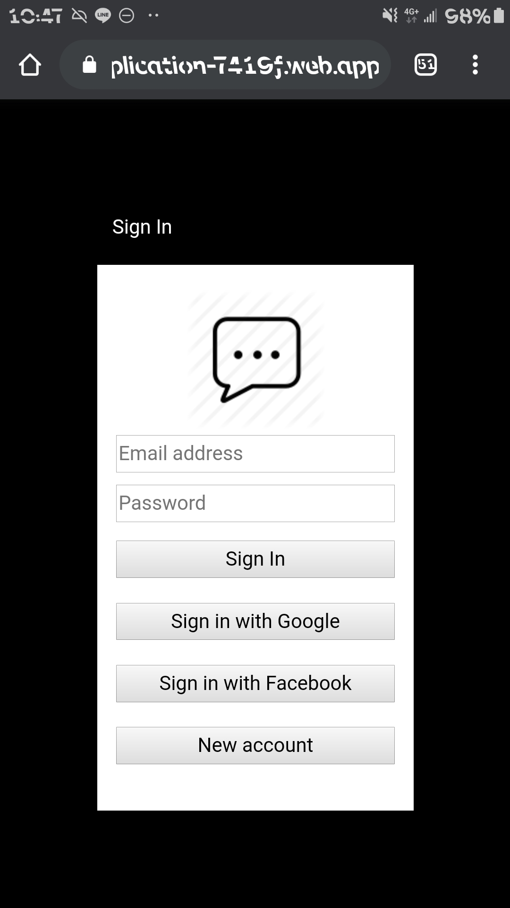
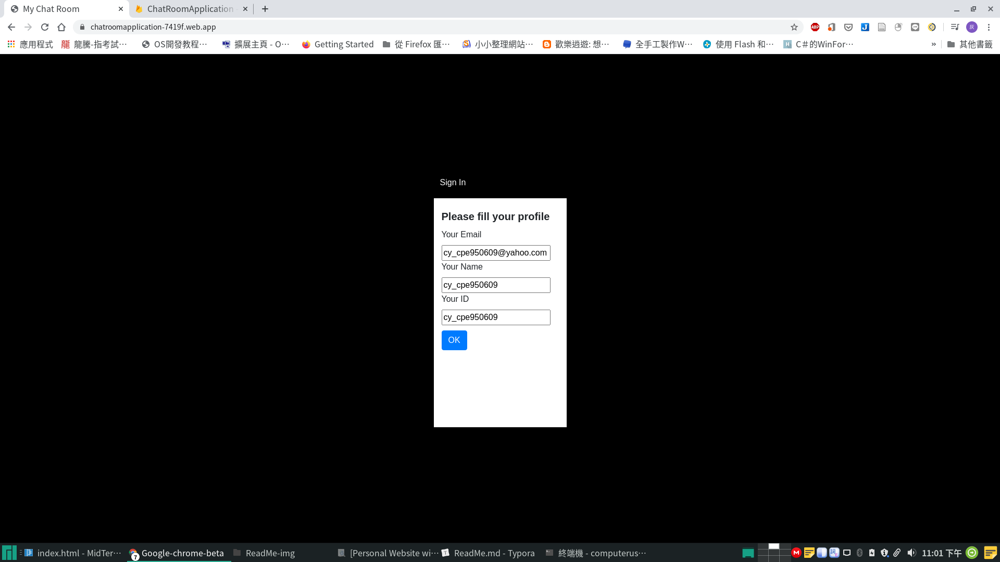
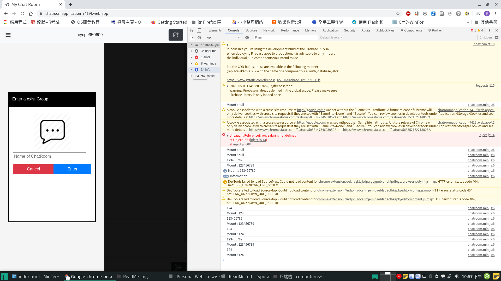
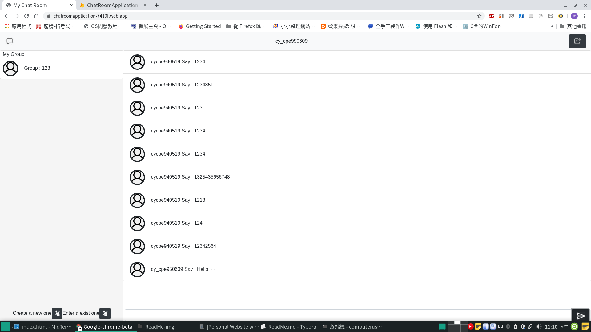
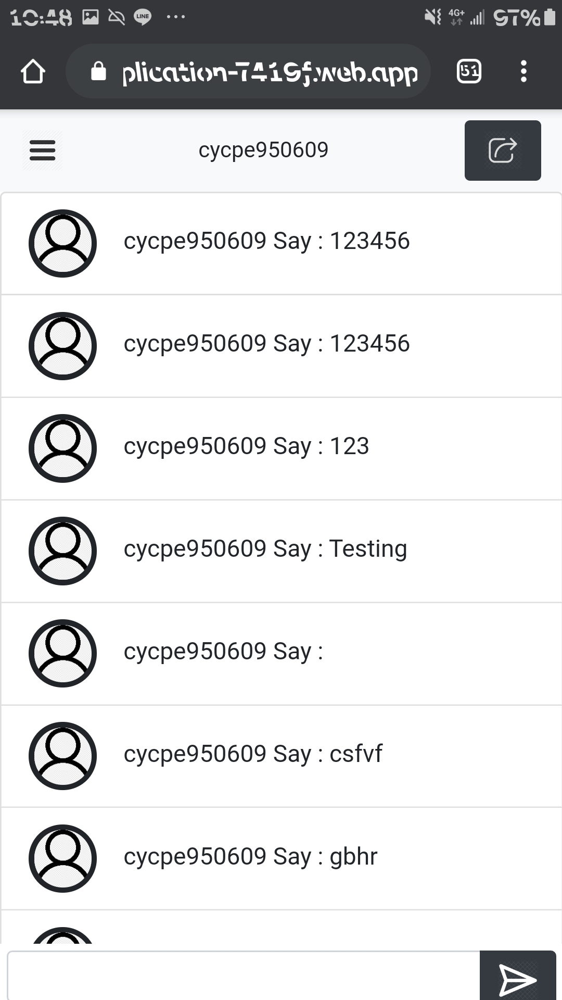
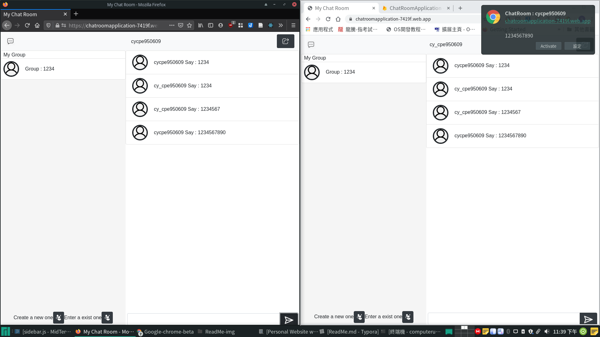

# Software Studio 2020 Spring Midterm Project
## Topic
* Project Name : Midterm_Project
* Key functions (add/delete)
    1. Login with Google/Facebook Account
    2. Create ChatRoom
    3. Enter ChatRoom by ChatRoom Name
    
* Other functions (add/delete)

## Basic Components
|Component|Score|Y/N|
|:-:|:-:|:-:|
|Membership Mechanism|15%|N|
|Firebase Page|5%|N|
|Database|15%|N|
|RWD|15%|N|
|Topic Key Function|20%|N|

## Advanced Components
|Component|Score|Y/N|
|:-:|:-:|:-:|
|Third-Party Sign In|2.5%|Y|
|Chrome Notification|5%|Y|
|Use CSS Animation|2.5%|Y|
|Security Report|5%|Y|

## Website Detail Description

# 作品網址：https://chatroomapplication-7419f.web.app

# Components Description : 
1. 登入 : 可以使用Google / Facebook 及信箱登入

1. 第一次登入：建立使用者名稱及ID
2. 新增群組 : 輸入群組名

1. 加入群組: 輸入群組名

   

2. 聊天室 ：顯示哪位使用者說了什麼。

3. 

4. Chrome Notisfication ：當網頁在後台及縮小時，會有彈出式通知。

   

# Other Functions Description : 
## Security Report (Optional)

1. 個人資料只能本人讀取
2. 聊天室只能由加入的人讀取聊天內容
3. 個人ID只能由本人修改，一般人只能讀。